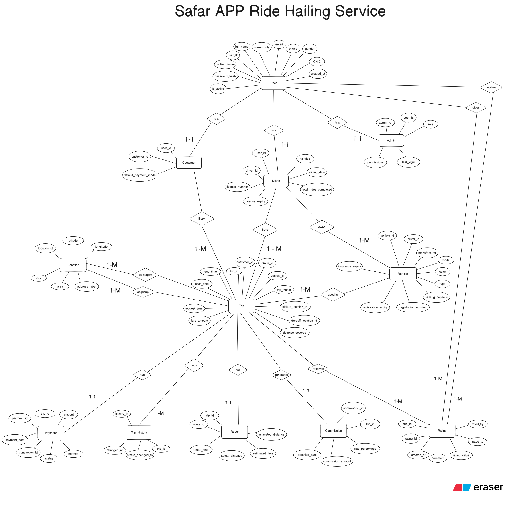
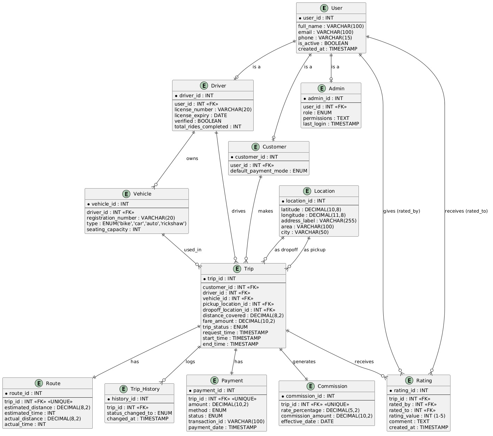

# Safar - Ride Hailing Database

A fully normalized relational database for a ride-hailing platform inspired by InDrive and Yango, designed and implemented as part of the **4th Semester DBMS Course** at Bahria University Lahore.

---

## Entity Relationship Diagram





---

## Database Schema Overview

The database consists of **12 normalized tables** with a User specialization hierarchy:

| Table | Description |
|-------|-------------|
| `tbl_User` | Base user entity (supertype) with profile, authentication, and city info |
| `tbl_Customer` | Customer specialization with default payment mode |
| `tbl_Driver` | Driver specialization with license, verification, and ride count |
| `tbl_Admin` | Admin specialization with role (super/mod/finance) |
| `tbl_Vehicle` | Vehicles owned by drivers (bike, car, auto, rickshaw) |
| `tbl_Location` | Pickup and dropoff locations with lat/lng coordinates |
| `tbl_Trip` | Core trip entity linking customer, driver, vehicle, and locations |
| `tbl_Payment` | Payment records per trip (cash, card, wallet) |
| `tbl_Rating` | Bidirectional rating system (Customer rates Driver + Driver rates Customer) |
| `tbl_Commission` | Platform commission tracking per completed trip |
| `tbl_Route` | Estimated vs actual distance and time per trip |
| `tbl_Trip_History` | Audit log for trip status changes |

### Key Design Features
- **Named Foreign Keys** for clarity (`FK_Customer_User`, `FK_Trip_Driver`, etc.)
- **CHECK Constraints** for data validation (gender, payment modes, trip statuses, rating ranges)
- **UNIQUE Constraints** to prevent duplicates (emails, CNIC, license numbers, registration numbers)
- **Referential Integrity** with `ON UPDATE CASCADE` where appropriate
- **Soft Delete** support via `is_active` flag on `tbl_User`

---

## SQL Features Covered

### DDL (Data Definition Language)
- `CREATE DATABASE`, `CREATE TABLE` with constraints
- `ALTER TABLE` (ADD, DROP, RENAME columns)
- `TRUNCATE TABLE`, `DROP TABLE`

### DML (Data Manipulation Language)
- `INSERT` with batch data (55 users, 30 customers, 15 drivers, 40 trips)
- `UPDATE` with subqueries and `WHERE` conditions
- `DELETE` (Hard + Soft delete patterns)

### Queries
- **JOINs**: `INNER JOIN`, `LEFT JOIN`, `RIGHT JOIN`, `FULL JOIN`, `SELF JOIN`
- **Subqueries**: `IN`, `NOT IN`, `ANY`, `ALL`, `EXISTS`, `NOT EXISTS`
- **Aggregations**: `GROUP BY`, `HAVING`, `COUNT`, `SUM`, `AVG`, `MIN`, `MAX`
- **Window Functions**: `DENSE_RANK()`, `RANK()`, `ROW_NUMBER()`
- **Pattern Matching**: `LIKE`, `BETWEEN`, `IN`

### Advanced SQL
- **Scalar Functions** for reusable business logic (`fn_CustomerTotalFare`, `fn_MonthlyRevenue`, `fn_CustomerAcquisition`)
- **Table-Valued Functions** for reporting (`fn_DriverTripLog`, `fn_TopCustomersByCity`, `fn_TripsPaymentsBetween`)
- **Stored Procedures** with parameters, cursors, and `IF-ELSE` / `WHILE` logic
- **Transactions** and **Triggers**

### Real-World Business Analytics
- Customer Lifetime Value (CLV) ranking with `DENSE_RANK()`
- Driver cancellation rate analysis
- Monthly payment method distribution (cash vs card vs wallet pivot)
- Churn risk detection (30-day inactivity)
- Trip duration anomaly detection (actual > 150% of estimated)
- Payments reconciliation with `FULL JOIN`
- Nearest available driver detection
- License expiry + inactivity risk alerts
- Driver utilisation rate calculation
- Top revenue routes with `RANK()`
- Tiered commission updates based on monthly trip volume

---

## Project Structure

```
safar-ride-hailing-database/
├── 01_schema_and_ddl.sql            # Database + 12 table definitions
├── 02_seed_data.sql                 # Sample data across 6 Pakistani cities
├── 03_basic_queries_joins.sql       # 25+ queries: CRUD, JOINs, subqueries
├── 04_advanced_queries_functions.sql # Functions, procedures, analytics
├── ERD.png                          # Entity Relationship Diagram
├── UML_Diagram.jpg                  # UML Class Diagram
└── README.md
```

---

## How to Run

### Prerequisites
- **Microsoft SQL Server** (2019 or later) or **Azure Data Studio**
- SQL Server Management Studio (SSMS) recommended

### Steps

1. **Clone the repository**
   ```bash
   git clone https://github.com/your-username/safar-ride-hailing-database.git
   cd safar-ride-hailing-database
   ```

2. **Create the database and tables**
   ```sql
   -- Run in SSMS or Azure Data Studio
   :r 01_schema_and_ddl.sql
   ```

3. **Insert sample data**
   ```sql
   :r 02_seed_data.sql
   ```

4. **Run basic queries**
   ```sql
   :r 03_basic_queries_joins.sql
   ```

5. **Run advanced queries and functions**
   ```sql
   :r 04_advanced_queries_functions.sql
   ```

> **Note:** Run the files in order (01 to 04) as later scripts depend on tables and data created by earlier ones.

---

## Sample Data

The seed data covers **6 Pakistani cities**:

| City | Users | Locations |
|------|-------|-----------|
| Lahore | 15 | 5 |
| Karachi | 15 | 5 |
| Islamabad | 10 | 5 |
| Faisalabad | 10 | 3 |
| Multan | 3 | 1 |
| Peshawar | 2 | 1 |

- **55 Users** (Customers, Drivers, Admins)
- **25 Vehicles** (Cars, Bikes across all cities)
- **40 Trips** (24 completed, 8 cancelled, 8 ongoing)
- **24 Payments**, **24 Ratings**, **24 Commissions**, **24 Routes**
- **140 Trip History** status change records

---

## License

This project is for educational purposes as part of the DBMS course at Bahria University Lahore.
